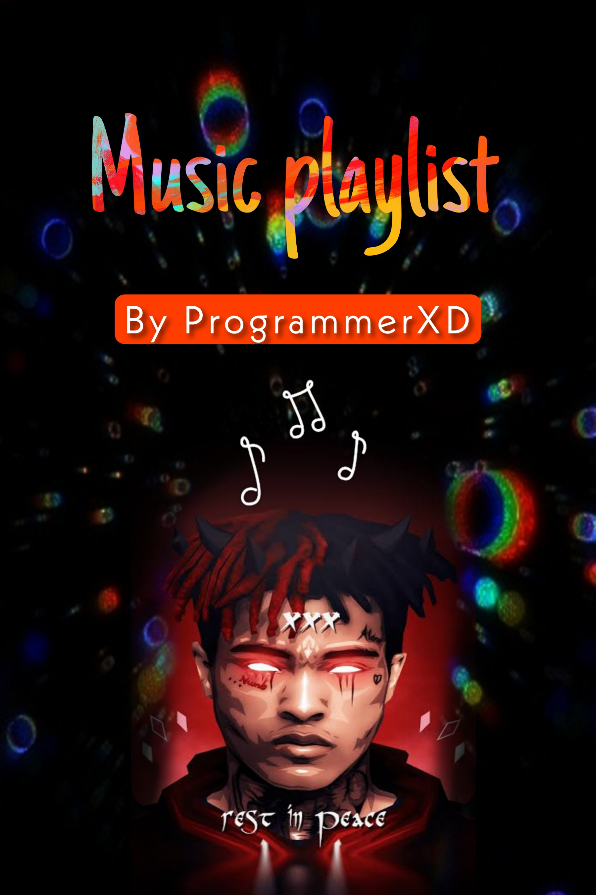

# Music Playlist 

<h2> Introducing the Music Player </h2> 

<h3> Current Playlist - XXXTENTATION ️</h3>
<spam> Learned the Audio interaction with HTML5 and many stuff. this was helpful in building a great skillset in web development. This is the Music player from which i would listen songs to <3   

<h4> Some usefull links </h4>
  
  

   

<h2 id="contact" > Contact me >> </h2> 
➖  
➖  
➖  
➖ 