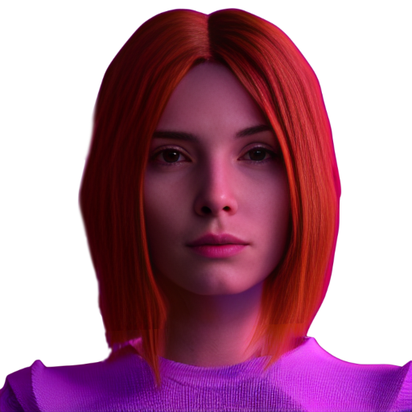

# ProgrammerXD

 
 I am Elsa , Assistant of #PXD .  And 'll give you all the information about this repo. 
 
 
<h2>Main repository of PXD</h2>

<h3> General  </h3>
 Website Link :-    
 Certificates :-   
 LinkedIn Profile :-   

<h3> Projects </h3>
<h4> Games </h4> 
 
 

<h4> Song Playlist </h4>
  

<h4> Clones </h4>
  
  

<h3> Contact PXD </h3>
 LinkedIn Profile :-   
 Instagram Profile :-   
 

 
 x__ END __x  